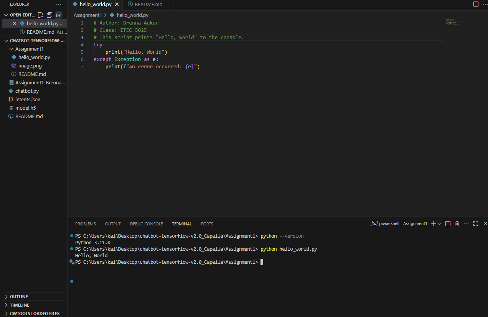

# Assignment 1

## Author
Brenna Auker

## Class
ITEC 5025

## Instructions
1. Open a terminal.
2. Navigate to the directory containing `hello_world.py`.
3. Run the following command:
```sh
python hello_world.py
```
