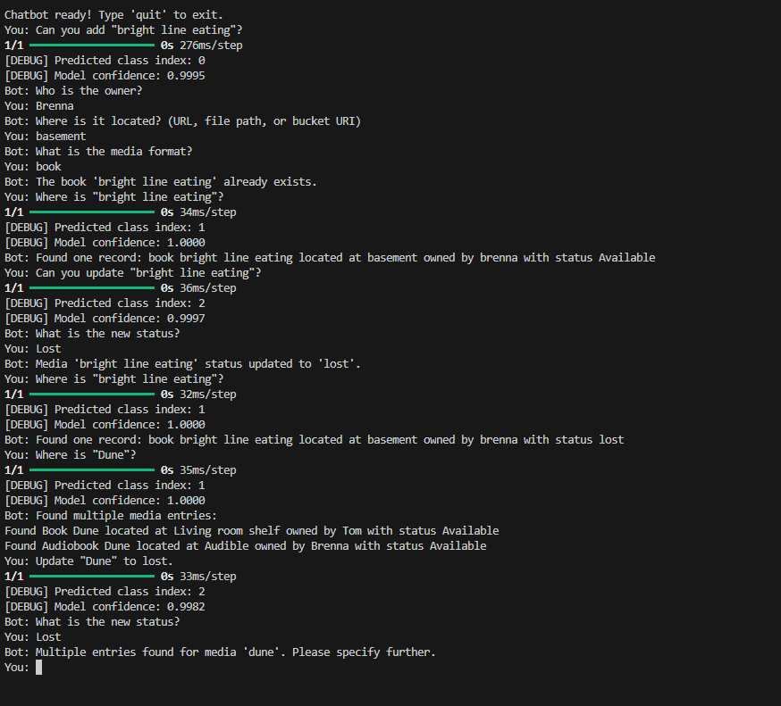

# Assignment 10

## Author
Brenna Auker

*With help with Github Copilot & ChatGPT*

## Class
ITEC 5025

## Important Notes

This chatbot uses postgres. I use a dockerfile for my postgres database but didn't include it here. It is just a basic docker image of pgvector/pg:17.

You can pull the image yourself and run it

```bash
docker pull postgres:17
docker run --name my-postgres-container -e POSTGRES_USER=postgres -e POSTGRES_PASSWORD=password -e POSTGRES_DB=postgres -p 5432:5432 -d postgres:17
```

Thank you for the feedback in Week 8. This works a lot better I think and I am getting better results I think in general for what I want to use this for. 

## File Structure

- `index.py`: Main application entry point.
- `process_data.py`: Script for processing and training data.
- `requirements.txt`: Python dependencies.
- `proof/`: Contains images and other supporting files.


## How to Run

1. Navigate to the project directory:
   ```bash
   cd "Assignment 10"
   ```

2. Install Requirements:
    ```bash
    pip install -r requirements.txt
    ```

3. (Optional) Run the training code:
   ```bash
   python process_data.py
   ```

   If this fails, delete `processed_convo_data.csv`, `vectorized.keras`, `chatbot_model.keras`

4. Run the main application:
   ```bash
   python index.py
   ```

## Noted Issues/Upgrades

- Doesn't always get the title unless it's in Quotes. Might want to fix that for myself
- Over trained model a bit I think. (Oh I did. Been reading about how to fix this but not a huge issue right now.)
- An actual UI interface outside the command line. An app maybe? 
- Process photos from the app and fill out the data as guesses and user confirms.
- FIXED ~~Add confidence check. Below 80% ask the user again.~~
- FIXED ~~If it finds multiples of something, updates multiples~~
- FIXED ~~Display better infomration when items are found~~
- FIXED ~~Doesn't get some more generalized requests. Need to work on that a bit more with the data~~

## Report

### Looking Back - Project Planning

My project has changed quite a bit if I am honest. I am not sure how to explain how the difference between them came to be. In week 6 I was still planning on the story idea and as the weeks progressed I realized real quick it was not the best idea. I pivoted to working on an inventory management system for my media for my husband and I. Nothing too big but something that could have a use if I wanted to continue it later. From feedback I got, I changed my training data a lot and what the bot returned a lot. It helped bridge the gap with my bot a lot and made it more easy to work with and eliminated a lot of code I didn’t need.

### Current Model Stats


### Testing and Validation

Testing was done through various means. I tested the bot myself and my husband also tested the bot. Many issues that were fixed were noted from my husband testing. I do not think unit tests are required for this code as in general, it will work or it won't work. That's just the nature of this project. If I planned to make bigger changes, I could see where unit tests would be utalized and helpful to make sure parts of this did not break. But by simply running the bot, issues will arise real quick.

The only hard aspect of testing was testing the low confidence. This was due to over training and the models confidence everything was searching. 

Examples of these tests are as following:

#### General/Edge Cases



#### Low Confidence

